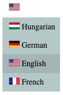
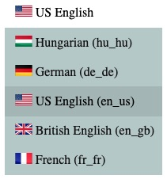
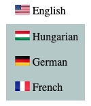
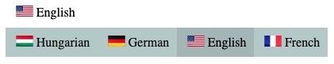
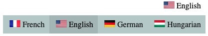
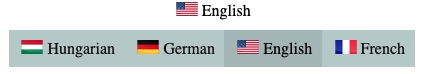
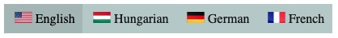

# Language selector menu for React

A flexible language selector component for React, where you can change the format and the look with many options. The actual state is stored in a context, whose value can be used in other parts of the project.
Part of the [@kekalma](https://www.npmjs.com/search?q=%40kekalma) component family.

## Usage examples

The following simple code example demonstrates the use of the language selector, with separate (optional) context and an event handler function.  
You should use at least one of `context` or `onLanguageChange` properties.



<br>  

__App.tsx__

_The `<LanguageSelector>` component can be placed into an `<ul>` element, as it produces a list item._

```tsx
import React,{useState} from 'react'
import {LanguageSelector as Language, emptyLanguage} from '@kekalma/language-selector'
import type { languageType } from '@kekalma/language-selector'
import { languageContext } from './context'
import Info from './Info'
import { languages } from './languageList'

export default function App() {
  const [selectedLanguage, setSelectedLanguage] = useState<languageType>(emptyLanguage);
  const changeHandler = (newLang: languageType, oldLang: languageType) => {
    console.log("The language has been changed: ", oldLang.name, " -> ", newLang.flag)
  }
  return (
    <languageContext.Provider value={{language: selectedLanguage, setLanguage: setSelectedLanguage}}>
    <Info context={languageContext}/>
    <ul>
      <Language
          languages={languages}
          selectedLanguageFlag="us"   
          context={languageContext}
          onLanguageChange={changeHandler}
      />
    </ul>
      <Info/>
    </languageContext.Provider>
  ) 
}
```

<br>

__languageList.ts__

```ts
import React from 'react'
import type { languageType } from '@kekalma/language-selector'

export const languages: languageType[] = [
  { "code": "hu","name": "Hungarian" },
  { "code": "de","name": "German" },
  { "code": "en","name": "US English","flag": "us" },
  { "code": "en","name": "British English","flag": "gb" },
  { "code": "fr","name": "French" }
]
```  

*Note the use of the 'flag' property. It is only necessary, if the same language may be used with a different flag from country to country. The `flag` is the ___key___, it should be unique!*

<br>

__context.ts__

```ts
import React, {createContext} from 'react'
import type {languageType, languageContextType } from '@kekalma/language-selector'
import {emptyLanguage } from '@kekalma/language-selector'

export const languageContext = createContext<languageContextType>({
  language: emptyLanguage,
  setLanguage: (value: languageType):void =>{}
})
```

<br>

__info.tsx__  

_In this component you get an example, how to use the value from the context._

```tsx
import React, {useContext} from 'react'
import { languageContext } from './context'
import {languageContextType} from '@kekalma/language-selector'

type myProps = { context: React.Context<languageContextType> }

export default function Info(props : myProps) {
  const { language : selectedLanguage } = useContext(props.context)
  return (
    <span style={{margin: "0 5px"}}>Selected language: {selectedLanguage.name} ({selectedLanguage.code}_{selectedLanguage.flag})</span>
  )
}
```

_The currently selected value is stored in the following format (`languageType`):_

```text
{
  code: string,   // ISO language code (2 chars)
  name: string,   // Language name
  flag: string    // Flag code (2 chars)
}
```

<br>

## Property parameters

_Only the ___bold___ properties are obligatory, all others are optional, but you should use one of `context` or `onLanguageChange`._

|property|format|Description|
|---|:---:|---|
|__languages__|languageType[ ]|__(Required)__ The JSON list of the languages, defined in the example file above.|
|selectedLanguageFlag|string|The initialy selected language. Default: first item.|
| context| React.Context<br>\<languageContextType> | Required. The context, to store the state and the handler. See the above example for the format. |
|onLanguageChange|Function<br>(newLanguage: languageType, oldLanguage: languageType)|The callback function for the change event. It is called with two parameters, holding the new and the old language objects. |
|titleFormat|string|A definition of the freely formatted label text, put together with `\|Flag\|` `\|Name\|` `\|Code\|` `\|FlagCode\|` placeholder, where `Flag` represents the flag icon.|
|menuFormat|string|- same as the above - |
|align||`left` - left aligned<br>`right` - right aligned<br>`center` - centered<br>`auto` - automaticaly aligned right if it is the last item in the list<br>`center auto` - center aligned, but automaticaly aligned right if it is the last item in the list|
|format||`dropdown` : classic dropdown menu<br>`dropdown-ordered` : dropdown, but the currently selected item is not listed <br>`flat` : the selectable items appear in a row, under the title <br>`flat-reverse` : same as the previous, but right aligned<br>`linear` : the items are shown permanently in a row<br>`linear-ordered` : same as before, but the selected item comes first in the list<br>`horizontal` : same as the previous, but the list is shown only upon hover<br>`horizontal-reverse` : same as the previous, but right aligned|
|titleFont|string|CSS font type, like `"1rem bold Verdana"`|
|titleFontColor|string|CSS font color, like `"#11F"`|
|titleFontColorHover|string|CSS font color during hover|
|titleBgColor|string|CSS background color|
|titleBgColorHover|string|CSS background color during hover|
|titleFlagSize|number|The size of the flag icon in pixels (without any dimension)|
|menuFont|string|CSS font type for the menu items|
|menuFontColor|string|CSS font color|
|menuFontColorHover|string|CSS font color during hover|
|menuFontColorSelected|string|CSS font color of the currently selected item|
|menuBgColor|string|CSS background color for the menu items|
|menuBgColorHover|string|CSS background color for the menu items during hover|
|menuBgColorSelected|string|CSS background color for the currently selected menu item|
|menuFlagSize|number|The size of the flag icon in pixels (without any dimension)|
|menuStyleSelected|CSSProperties|Inline CSS definition for the currently selected menu item|
|titleStyle|CSSProperties|Inline CSS definition for the title|
|menuStyle|CSSProperties|Inline CSS definition for the list items|
|style|CSSProperties|Global inline CSS definiton object|

<br>

## __Exported type definitions (Typescript)__

|exported item|Description|
|---|---|
|languageProps|All the properties listed above.|
|languageContextType|Context type definition.|
|languageType|Type holding the language properties: code, name, flag.|
|emptyLanguage|The type `languageType` with empty values.|


<br>

## __Format examples with property code samples__

### __`dropdown:`__



```JSON
titleFormat="|Flag| |Name|"
menuFormat="|Flag| |Name| (|Code|_|FlagCode|)"
format="dropdown"
align="left"
```

<br>

### __`dropdown-ordered:`__



```JSON
titleFormat="|Flag| |Name|"
menuFormat="|Flag| |Name|"
format="dropdown-ordered"
```

<br>

### __`flat:`__



```JSON
titleFormat="|Flag| |Name|"
menuFormat="|Flag| |Name|"
format="flat"
```



```JSON
titleFormat="|Flag| |Name|"
menuFormat="|Flag| |Name|"
format="flat-reverse"
align="right"
```



```JSON
titleFormat="|Flag| |Name|"
menuFormat="|Flag| |Name|"
format="flat"
align="center"
```

<br>

### __`linear:`__



```JSON
titleFormat="|Flag| |Name|"
menuFormat="|Flag| |Name|"
format="linear-ordered"
```

<br>

<hr>

## __`Changelog:`__

|Version|What's new, description|
|:---:|:---|
|1.0.0|First official, working release.|

<br>

## License

MIT © [kissato70](https://github.com/kissato70)

<br>  

### Support the project >>> [Donation](https://bit.ly/kissato70_paypal_donate)